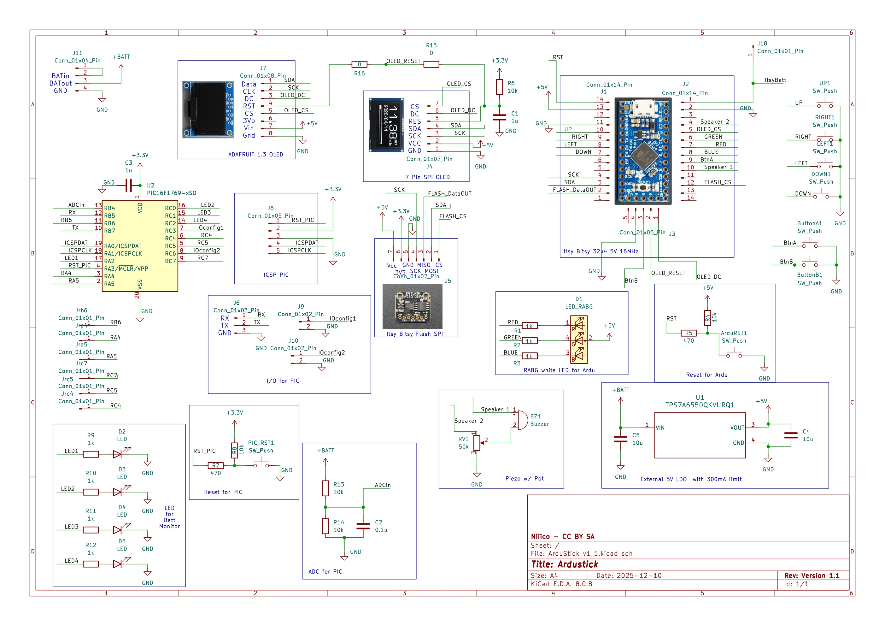
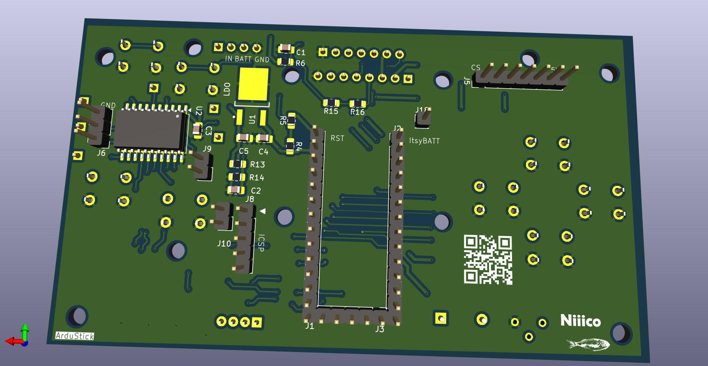
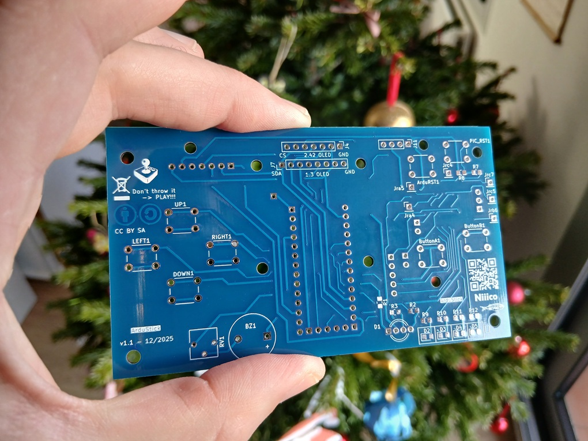
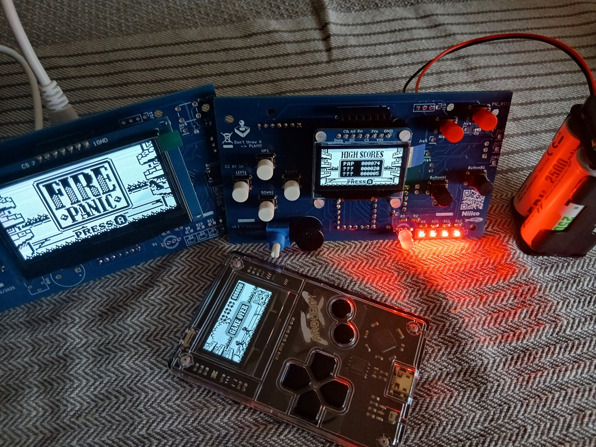

# ArduStick

License: CC BY SA 4.0

DIY Clone of Arduboy game console, with ... a little addition :)

Tests and assembly are ongoing!

This was done as a way to get hands on experience with some tools, such as KiCad (schematics, layout), 0805 SMD soldering,
8bit PIC microcontroller.

The main purpose is also to build myself a DIY Arduboy FX clone in an arcarde bartop format, with full scale arcade stick and buttons.

Stay tuned

# Main features of ArduStick:

- 2.42 inch SPI oled screen & swappable screen (other footprint for 1.3 inch SPI)
- swappable flash (a.k.a FX version)
- AkuMon & dual core to monitor battery charge: https://github.com/NicoRouger/AkuMon & https://github.com/NicoRouger/AkuMon_Software
- Initially developed for a bartop & arcade stick DIY clone of Arduboy
- NiMH battery & more
- alternative format with same pcb: can be use as a portable device!
- volume pot (ish)
- 5v & 3.3 on board
- possibility of other i/o from pic16f and uart

# Other functionnalities (to be developped?)
other functionnalities from pic16f: memory?bat logging? play time?additionnal miroir controller (???)

# Design Consideration
## Supply voltage?
4xAA for availability, close to 5V and considering primary use of ArduStick as a portable bartop Arduboy FX Clone.

- Input in 5V ? Batt ? external LDO? 

- Monitor remaining capacity ? >>> I developed AkuMon, 

- Flexible AA types: NiMH, Alkaline, or maybe 9V (but higher losses with LDO) or LiPoly

## 32u4 version? 

Itsy bitsy not that common

## Connection?
(original vs new?)

## Screen?
which one?

## Extra usage?
Initial goal and other usage: Ardustick and other use as portable homemade Arduboy FX clone.

# Step 0: Buy an Arduboy FX
Big thanks to community, tool makers, game makers!
Buy an official Arduboy! https://www.arduboy.com/shop
It is fun and well made!

# Step 1: Bootloader burning
Assemble Itsy Bitsy: soldering (lead free!)
Arduino R4 wifi as ICSP
breadboard for heartbeat, ...

# Step 2: Solderless breadboarding
Assemble Flash
Assemble Screen (see issues/problems)

# Step 3: Flash games
Make an image
Burn using python GUI

# Step 4: Check (and fun!)
Play!
Some issues // check current and voltage level

# Step 5: Schematics and layout
A great way to get some experience with KiCad.

## Schematics
Version 1_1

PDF available:
[Schematics](./Images/ArduStick_v1_1.pdf)

## Layout (2 layer PCB)

## Photo of PCB

# Step 6: Assembly (PCB and parts)
List of parts to be populated
Soldering: PCB
Soldering: Panel (buttons and supply)
Test sequence

Video:
PCB_Test1.mp4

*Video: Demo - Preliminary test with PCB v1_1*
<video src="https://github.com/NicoRouger/ArduStick/blob/0ed8bd9fb8c8747ae225042cf2bd80a993b30226/Videos/PCB_Test1.mp4" width="360" height="480" controls></video>

# Step 7: Bartop machining

# Step 8: Pure fun!

# Added function: AkuMon! -> Monitor the battery charge!
PIC16F1769
Schematics & design
I/O
Accuracy
Config: 2 bits to choose: Alkaline, NiMH, LiPO, 9V (requires changes of resistor bridge)
UART
ICSP
List of parts to be populated
Possible future evolutions

# Mistakes, trials & errors, food for though
SSD1309 screen: lack of diagram, datasheet. Issue with OLED_RST

Current draw and regulator!

utterly crappy solderless breadboards

White LED: RABG

# Bonus: Use as a portable device with 1.3 OLED SPI SSD1306

Alternative use of same PCB!

# GITHUB repos

https://github.com/NicoRouger/ArduStick

https://github.com/NicoRouger/AkuMon

https://github.com/NicoRouger/AkuMon_Software

# List of useful resources
See: https://community.arduboy.com

# Author

Nicolas Rouger, FR

a.k.a Niiico

Weekend and evening's project :)

# License

All files, pictures, video, schematics are:
CC BY SA 4.0 (Creative Commons Attribution, Share A Like, International 4.0)