# ArduStick

License: CC BY SA 4.0

DIY Clone of Arduboy game console, with ... a little addition :)

Tests and assembly are finished!

[X] Tested and working project

This was done as a way to get hands on experience with some tools, such as KiCad (schematics, layout), 0805 SMD soldering,
8bit PIC microcontroller, which is added in a 8bit **dual core** approach to keep the Arduboy clone in its basic format but with
added functions.

The main purpose is also to build myself a DIY Arduboy FX clone in an **arcarde bartop format**,
 with full scale arcade stick and buttons.
 
This was also an occasion to add some functionnalities and changes to the original - see below - mostly 
via an added 8 bit microcontroller used to monitor the state of charge and some other minor functions.

The final prototype:

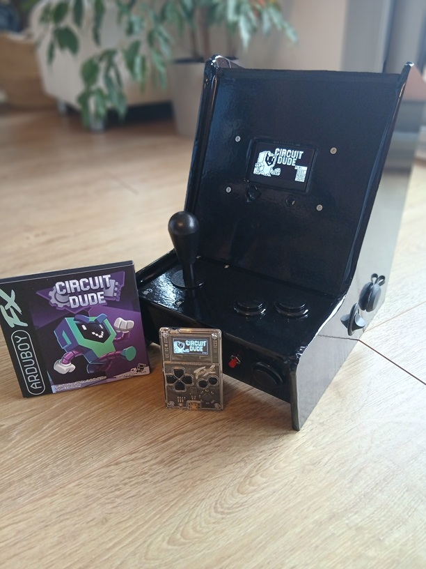

And the initial tests on breadboard:

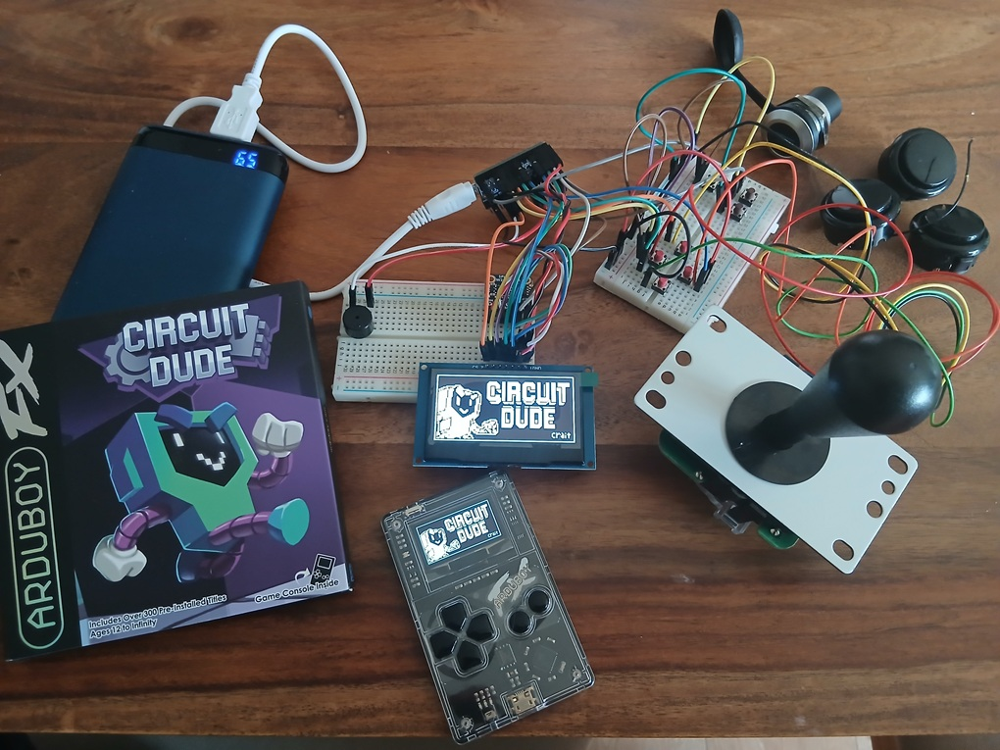

Circuit Dude is shown here as an example, from Crait - see https://community.arduboy.com/t/circuit-dude-3-2/2490 

# Main features of ArduStick:

- 2.42 inch SPI oled screen & swappable screen, both from a socket for 2.42 and another footprint for 1.3 inch SPI
- swappable flash (a.k.a FX version)
- AkuMon thanks to *dual core* to monitor battery state of charge (SOC): https://github.com/NicoRouger/AkuMon & https://github.com/NicoRouger/AkuMon_Software
- Initially developed for a bartop & arcade stick DIY clone of Arduboy
- NiMH battery & more - can be selected with two config bits (4 states: Alka, NiMH, LiPoly, or 9V batt, see related repo for more info.)
- alternative format with same pcb: can be used as a portable device!
- volume pot and volume ON/OFF swith
- regulated 5 V & 3.3 V on board. 5 V from external LDO and 3.3 V from Adafruit's Flash
- possibility of other i/o from pic16f and uart
- can be supplied from 4xAAA, 4xAA (NiMH or Alkaline OK), also from LiPoly and 9V battery, thanks to added 40V LDO!
- can be supplied from USB (micro usb) from Itsy Bitsy
- Reset Buttons for both cores: itsy bitsy (goes back to menu) and 8bit PIC (restart the program, which measures the SOC and blink LEDs)

# Other functionnalities (to be developped?)
other functionnalities can be implemented from pic16f: memory?bat logging? play time?additionnal miroir controller (???) serial communication and more.

# Design Consideration
## Supply voltage?
4xAA or 4xAAA were chosen for availability, close to 5V and considering primary use of ArduStick as a portable bartop Arduboy FX Clone. Also for large capacity (>2000 mAh, which should provide more than 10 hours of gameplay).

**Warning**: Fresh 4x batteries can be above 5 to 6 V, and also as low as 4 V when discharged!  Two options: supply via the itsy bitsy LDO (ref: 150mA LDO 5 V
MIC5225-5.0, 
input voltage 2.3V to 16V, 
10 µF in/out cap, 
BAT pin
)  or via an external LDO. The second approach was chosen, because 2.42 SPI OLED screens were found to draw a lot of current,
possibility due to their poor boost converter (high current ripple - tbc) and overall larger current than 0.96 or 1.3 SPI screens.
An extra LDO was selected, based on availability, limited time for choosing, price (TPS7A6550QKVURQ1,
300mA LDO 5 V, input voltage <4 V to 40V). Cheaper LDO can also be used without any problem.

- Input in 5V ? Batt ? external LDO and USB! 

- Monitor remaining capacity ? >>> I developed AkuMon, to monitor state of charge

- Flexible AA and AAA types: NiMH, Alkaline, or maybe 9V (but higher losses with LDO - resistor bridge must be changed) 
or LiPoly

## 32u4 version? 

I chose the Itsy bitsy from Adafruit: https://learn.adafruit.com/introducting-itsy-bitsy-32u4/ 

The 5V 16 MHz version. Because it is already avalaible, has the USB connector and other required parts. It was shown to be compatible with the official Arduboy FX - see https://github.com/MrBlinky/Arduboy-homemade-package

## Connection?
(original vs new?) -> I used the "new" connection.

## Screen?
which one? -> Many are available. I chose one with 7 pins, SPI SSD1309, 2.42 inch, already soldered. 

## Extra usage?
My goal was to use the same PCB for both the Ardustick (Arcade bartop with 2.42 inch screen) and also for another use as portable homemade Arduboy FX clone (with pushbutton on PCB and 1.3 inch screen).

# Step 0: Buy an Arduboy FX - seriously!
Big thanks to community, tool makers, game makers!

Buy an official Arduboy! https://www.arduboy.com/shop

It is fun and well made! I have the FX black edition and the whole family loves it!

The arduboy FX with USB-C is also coming, please consider supporting Arduboy.

# Step 1: Bootloader burning
The first steps are:
- Assemble Itsy Bitsy: soldering the headers (I used lead free!)
- Program Arduino (I used a R4 wifi) as ICSP (I used the example in the Arduino IDE.) The sketch is also attached here, where I used the OLD Style WIRING #define USE_OLD_STYLE_WIRING  [Sketch](./Code/ArduinoISP.ino) to use pins from the Arduino 10,11,12,13
- (optional) Make the breadboard for heartbeat during programming, using pins 7,8,9

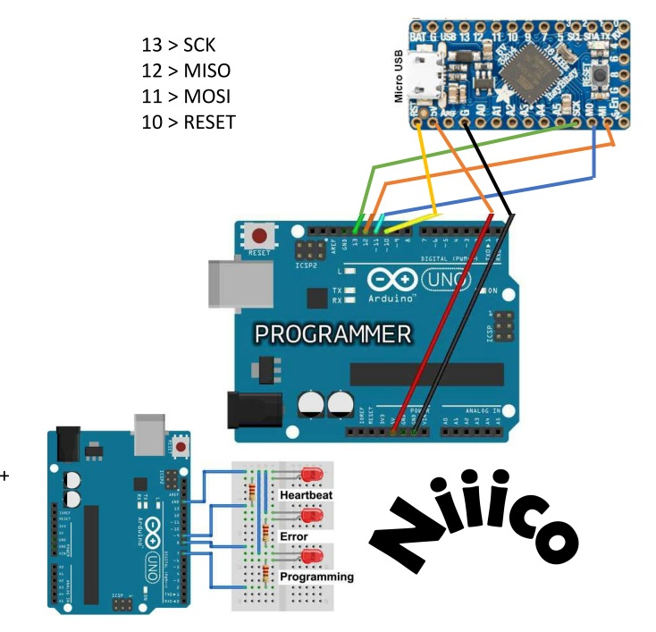

picture modified from https://docs.arduino.cc/built-in-examples/arduino-isp/ArduinoISP/

Once the Arduino is loaded as a ICSP, the ATmega32u4 from Itsy Bitsy can be programmed as a homemade arduboy FX

- Disconnect the arduino
- Make the connections between arduino ISP and target Itsy Bitsy
- Follow the tutorial from [@MrBlinky](https://github.com/MrBlinky) - many thanks for such amazing tools!
https://github.com/MrBlinky/Arduboy-homemade-package

I used those settings for the Ardustick, using SSD1309:

Board > Homemade Arduboy

Based on > Arduino Leonardo (or Micro)

Bootloader > Cathy3k (boot menu)

Display Contrast > Normal

Core > Arduboy Optimized

Display > SSD1309

Flash SELECT > Pin 2 / D1 / SDA (Official) (FLASH CS NEW!)

Programmer > Arduino AS ISP (Check connection!!!)

IF UNO R4 WIFI is used, the "Arduino as ISP 32u4" must be used

Burn Bootloader!

# Step 2: Solderless breadboarding
Assemble Flash, Screen (see issues/problems), and Itsy bitsy.

Only one or two pushbutton is necessary at this stage to do some testing.

# Step 3: Flash games
Make an image of the games: can be available at https://www.bloggingadeadhorse.com/cart/Cart.html 

Flash the game cart using python GUI from [@MrBlinky](https://github.com/MrBlinky) - many thanks for such amazing tools!
https://github.com/MrBlinky/Arduboy-Python-Utilities 

If SSD1309, consider using the "apply SSD1309 patch"

# Step 4: Check (and first fun!)
Play!
Some issues // check current and voltage level

# Step 5: Schematics and layout
A great way to get some experience with KiCad.

## Schematics
Version 1_1

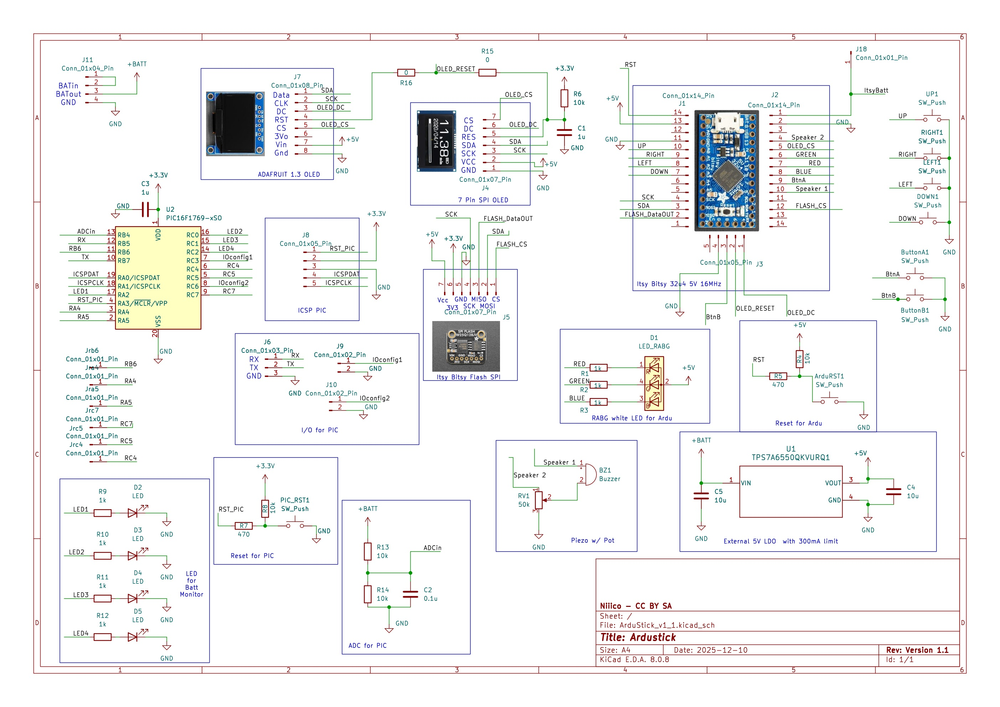

PDF available:
[Schematics](./Images/ArduStick_v1_1.pdf)

Consider some minor modifications / comments:

Pin 3 from the volume POT (RV1) must not be grounded. It should be either floating or more preferably, shorted to pin 2.

Adjust the LED resistors depending on the LEDs and desired light power.

I used sockets for the screens, Itsy Bitsy and Flash memory.

Populate only one resistance from R15 and R16, depending on the screen used. For my SSD1309, I even left R15 unpopulated, because the screen has already a pull up on RST with RC.

## Layout (2 layer PCB)

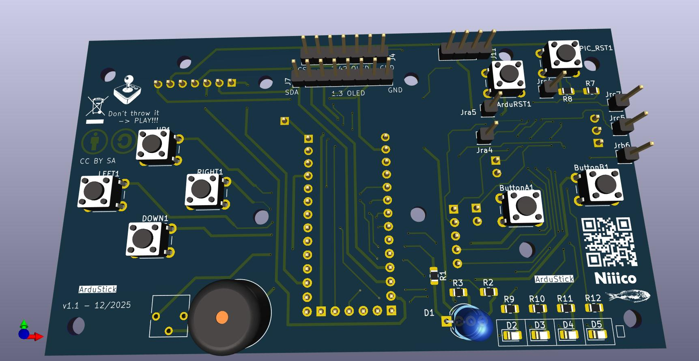
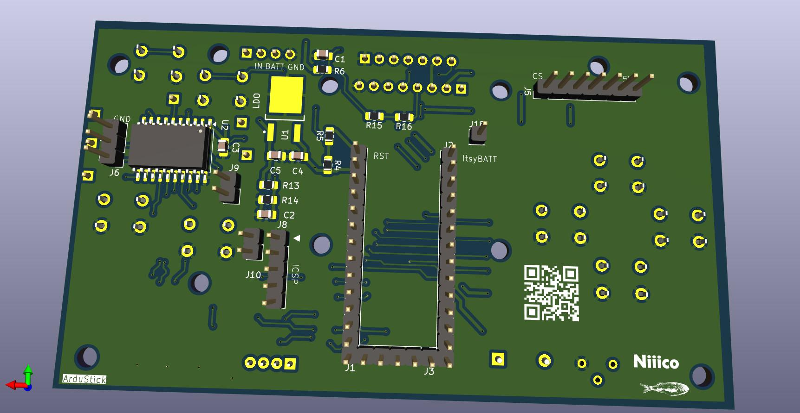

## Photo of PCB
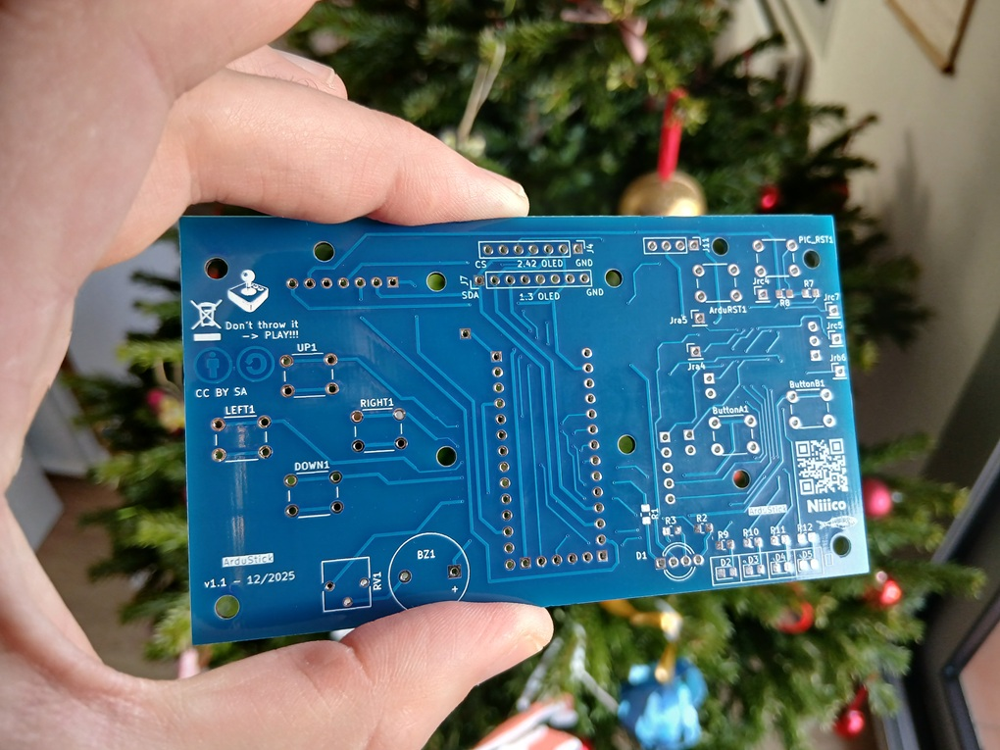
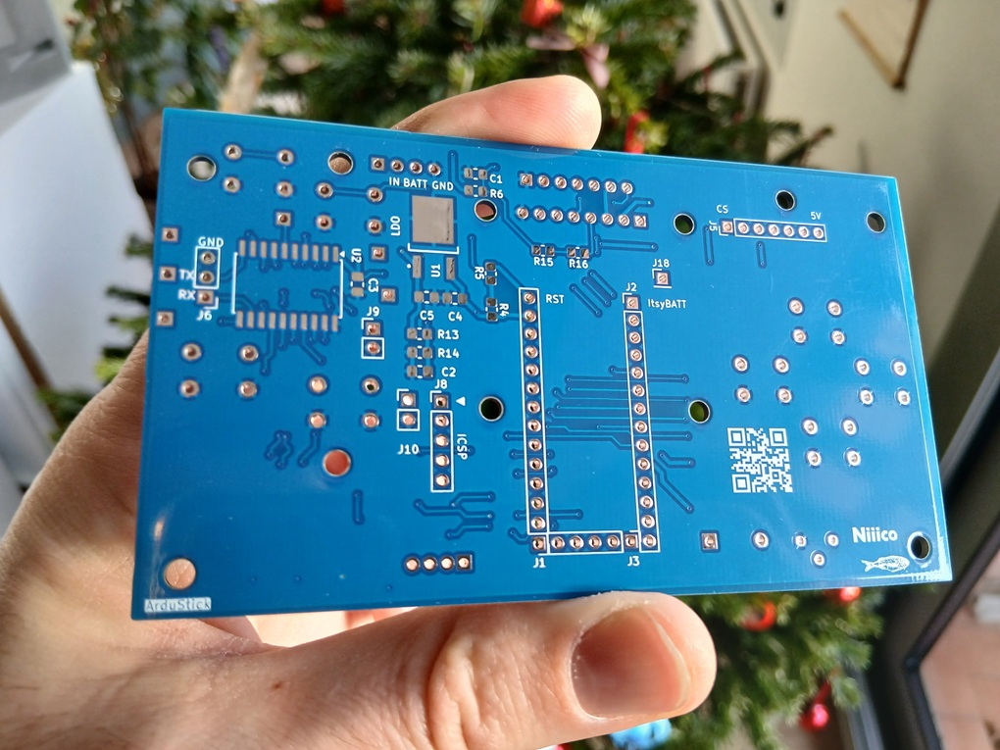

# Step 6: Assembly (PCB and parts)
Soldering: PCB

*PCB from backside, soldered by myself*

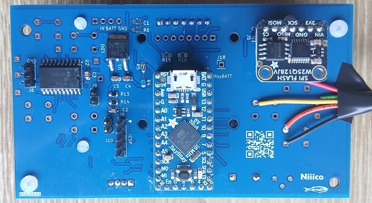

*PCB from frontside, soldered by myself, zooming on the 4 LEDs from AkuMon!*

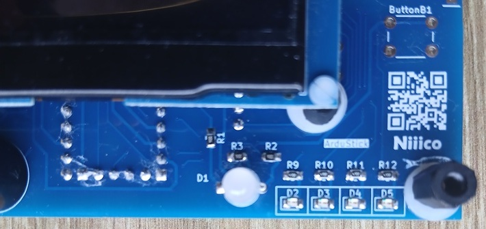

Some tests of other prototypes from the same PCB batch:

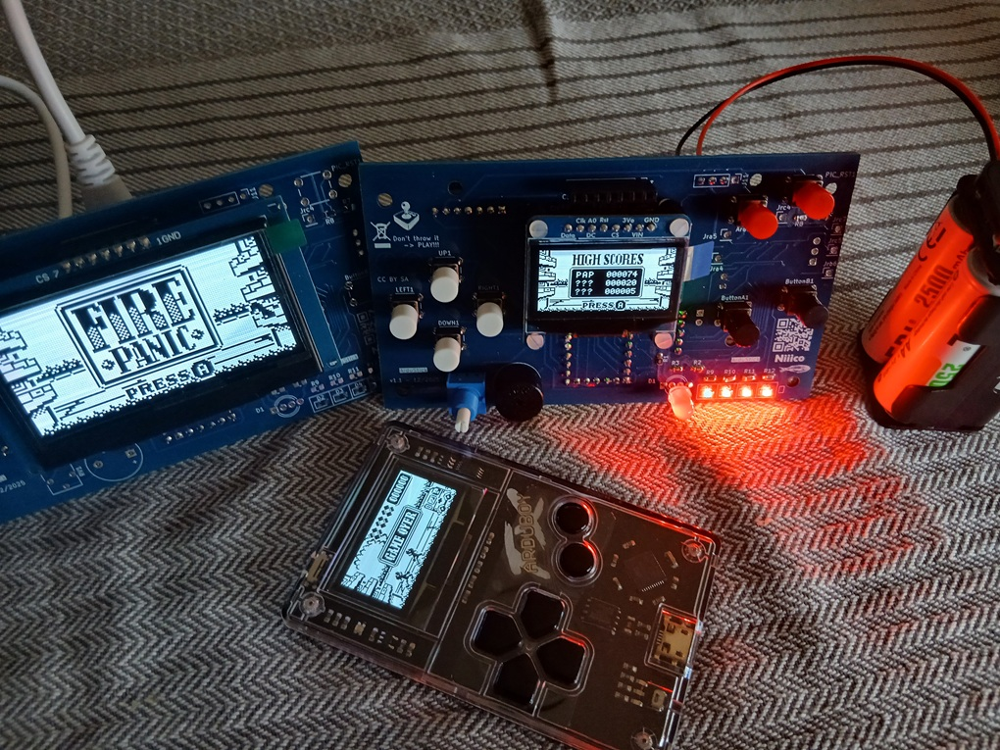

Video:
PCB_Test1.mp4

*Video: Demo - Preliminary test with PCB v1_1*

<video src="https://github.com/user-attachments/assets/c62bdb68-0ea3-4772-b8cc-c49146979524" width="320" height="180" controls></video>

[Video](./Videos/PCB_Test1.mp4)

*Video: Demo - Preliminary test with PCB v1_1: in case of low battery!*

<video src="https://github.com/user-attachments/assets/d2a6dbc8-d92a-4d3e-8e8a-430d5bdfd4f8" width="180" height="320" controls></video>

[Video](./Videos/PCB_Test1_LowBATT.mp4)

# Step 7: Bartop machining
I used MDF wood I had, from some leftover. I did not follow any layout from somewhere, just trying to find the most simpler design, which would fit with my leftover wood.

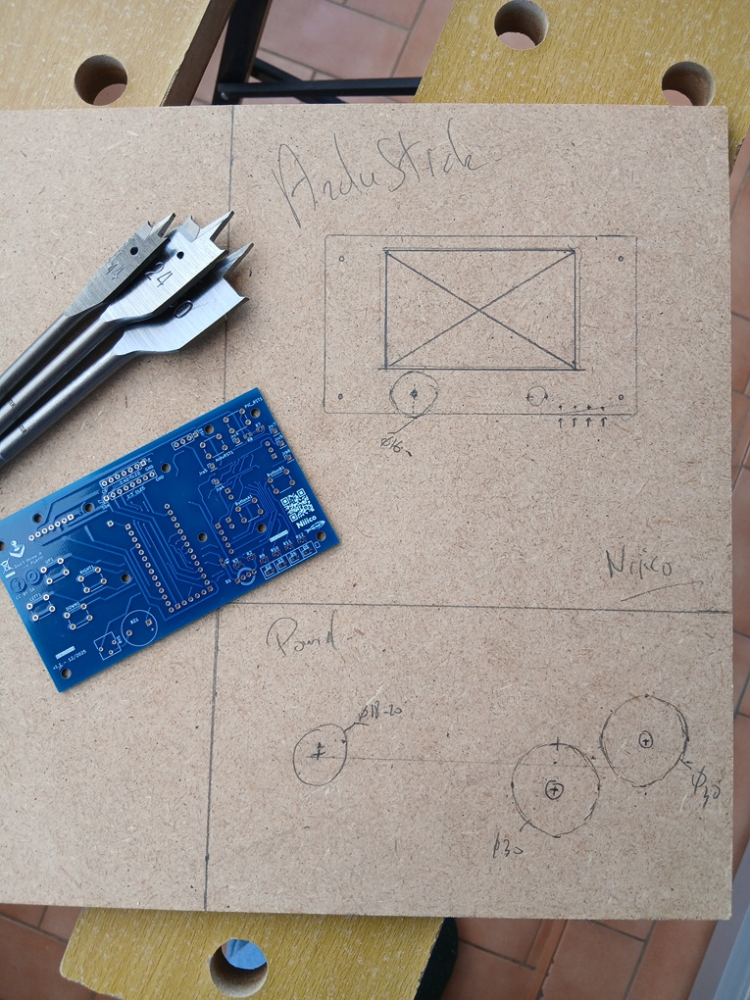

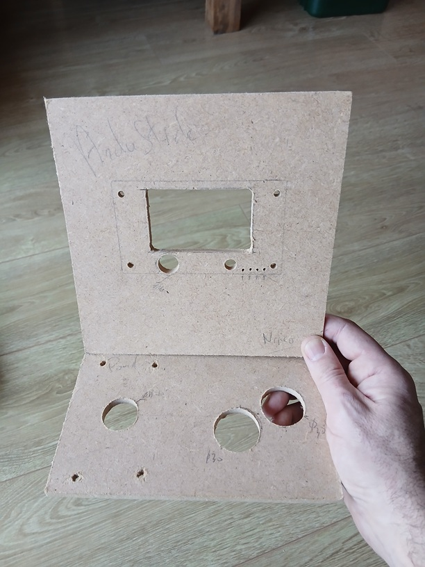

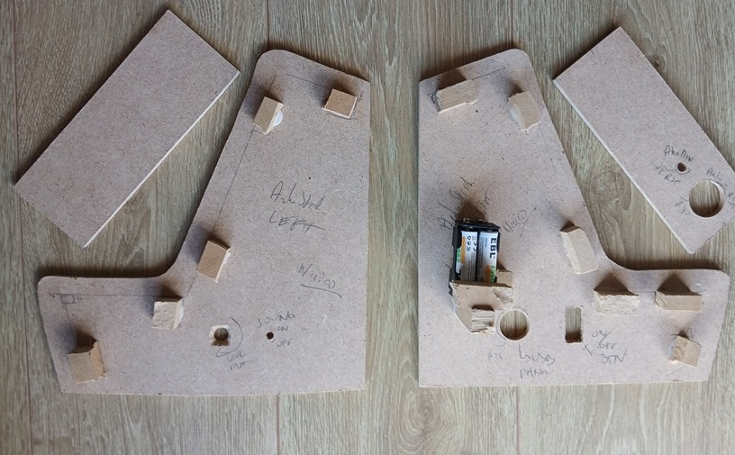

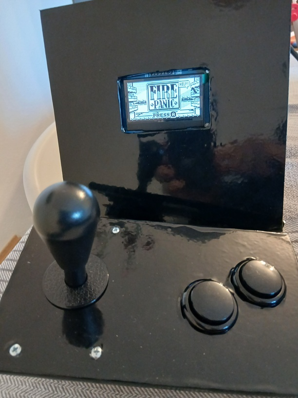

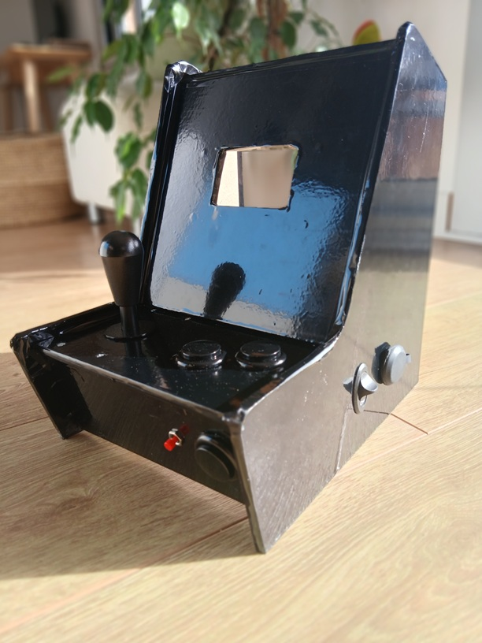

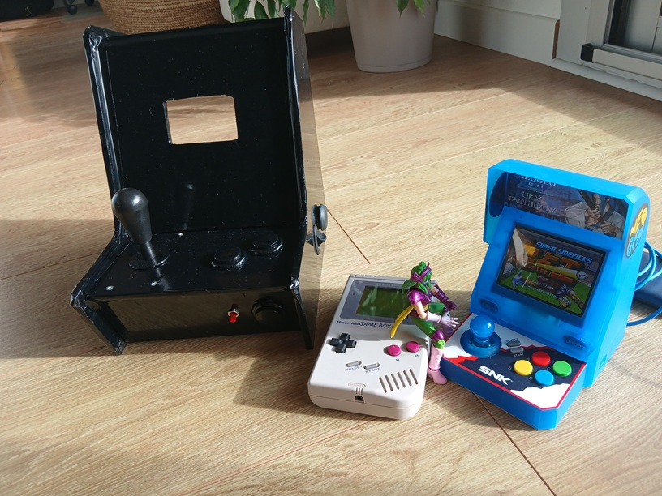

For the controls:
- Obviously, one arcade stick. With a battop, to acknowledge the US motherland of the Arduboy. This is also a leftover from another arcade stick I modded. I used an harness for the connector.
- 2x 30mm buttons, for A and B
- 1x 30mm button, for Arduino Reset (to go back to the menu)
- 1x button for PIC reset
- 1x SPDT switch for battery ON/OFF 
- 1x USB/USB feedthrough, to connect the Itsy Bitsy from the outside of the case
- 1x SPDT switch for VOL ON/OFF, in series with the volume POT
- 1x 50k POT for volume (log is better, I had a linear one)
- 1x battery holder - I used one similar to a 9V socket, but for 4xAA batteries in series

# Step 8: Final assembly and Pure fun!
Some final soldering for the buttons and switches!

The outside:

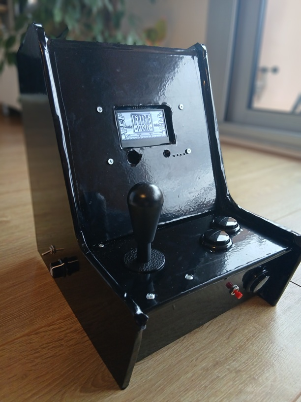

Inside:

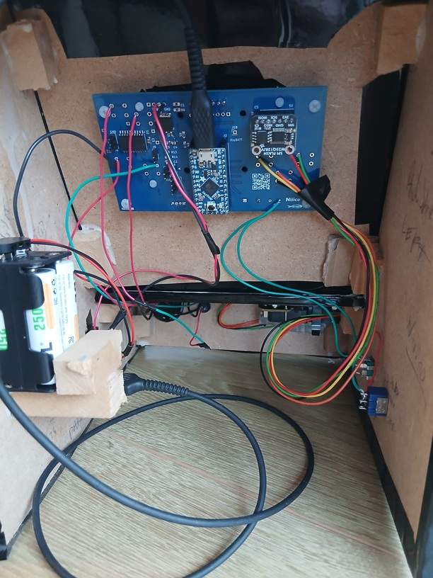

# Added function: AkuMon! -> Monitor the battery charge!
The small red button is used to reset the second 8 bit core (PIC16F). This triggers a measurement of the battery voltage and shows the battery level through the 4 LEDs. I think this function was missing somehow, and I wanted to keep the Arduboy core without any change. Hence, I used a second core, of course via another 8 bit micro controller.

All information are available: https://github.com/NicoRouger/AkuMon & https://github.com/NicoRouger/AkuMon_Software

The second core is programmed via a microchip programmer (I use the snap), and the socket J8 on the schematics for ICSP.

# Mistakes, trials & errors, food for though
SSD1309 screen: lack of diagram, datasheet. Issue with OLED_RST

Current draw and regulator!

utterly crappy solderless breadboards

1. program bootloader
2. 3.3v vs 5v compliant?
3. black screen aka rst pin
4. low current power bank
5. supply?

White LED: RABG

I might develop on those problems later...

# Bonus: Use as a portable device with 1.3 OLED SPI SSD1306

Alternative use of same PCB: can be used as a portable device, with a SSD1306 ! Fully compatible then with the Arduboy FX

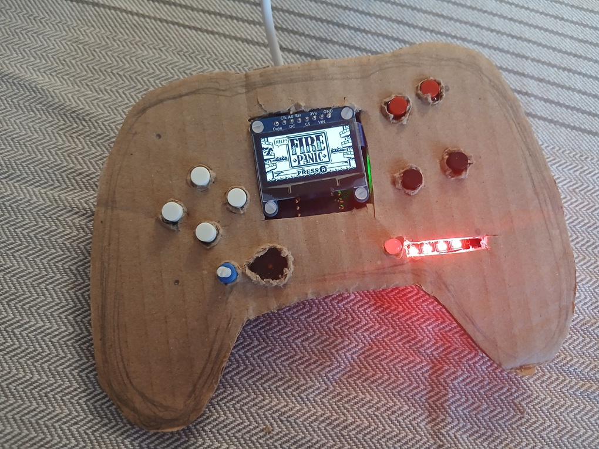

Yes, cardboard Arduboy :)

# GITHUB repos & required files

This repo: https://github.com/NicoRouger/ArduStick

The schematics and more details on AkuMon, to monitor the SOC: https://github.com/NicoRouger/AkuMon

and its software: https://github.com/NicoRouger/AkuMon_Software

# List of useful resources
See: https://community.arduboy.com

# Author

Nicolas Rouger, FR

a.k.a Niiico, [@NicoRouger](https://github.com/NicoRouger)

Weekend and evening's project :)

# License

All files, pictures, video, schematics are:
CC BY SA 4.0 (Creative Commons Attribution, Share A Like, International 4.0)

# Versions
## Feb 2026
- Final assembly of the bartop

## Version 1_1
- Initial release with preliminary files
- Schematics
- Some pictures of prototypes, including PCB
- December 2025
